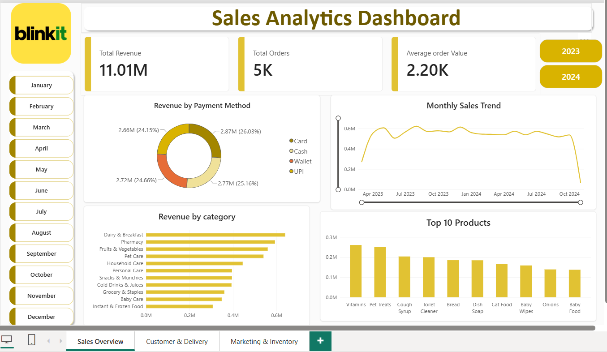
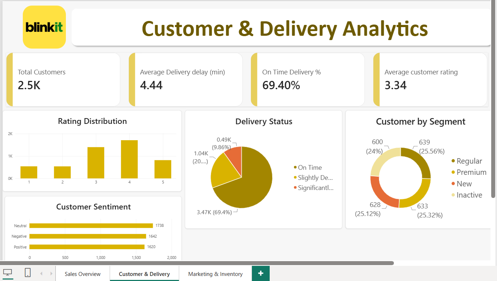
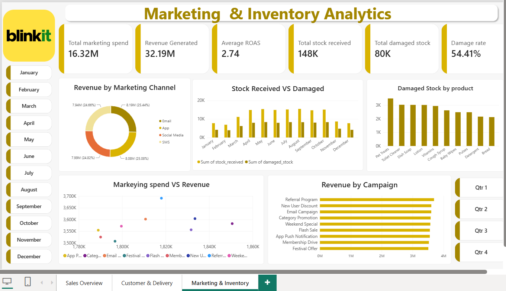

# Blinkit Sales Analytics

An end-to-end sales analytics project using Excel, SQL, and Power BI to analyze Blinkit's sales, customers, products, inventory, delivery performance, marketing performance, and customer feedback.

##  Project Overview

The goal of this project was to analyze Blinkit's business data and identify useful insights related to sales performance, customers, products, inventory, deliveries, marketing campaigns, and customer satisfaction.

The project follows an end-to-end data analytics workflow:

**Excel → SQL → Power BI**

## Tools & Technologies

- Excel – Data cleaning and preparation
- PostgreSQL – SQL analysis
- Power BI – Data visualization and dashboard creation

## Dataset

The dataset used for this project was obtained from Kaggle that contains multiple tables covering:

- Customers
- Orders
- Order Items
- Products
- Inventory
- Delivery Performance
- Marketing Performance
- Customer Feedback

## Analysis Performed

### Sales Analysis
- Analysed total revenue, orders and average order value
- Studied monthly sales trends
- Compared revenue across payment methods and product categories
- Identified top-performing products

### Customer & Delivery Analysis
- Analysed customer segments and ratings
- Examined customer sentiment
- Evaluated delivery status and delays
- Calculated on-time delivery performance

### Marketing & Inventory Analysis
- Compared marketing spending with revenue generated
- Analysed ROAS across campaigns and channels
- Compared stock received with damaged stock
- Identified products with higher damaged-stock levels

## Key Insights

- The project generated ₹11.01M in revenue from 5K orders, with an average order value of ₹2.20K.
- Dairy & Breakfast was the highest-revenue category, while Vitamins was the top-performing product among the top 10 products.
- Only 69.4% of deliveries were completed on time, with an average delivery delay of 4.44 minutes.
- Marketing generated ₹32.19M in revenue from ₹16.32M spend, resulting in an average ROAS of 2.74.
- Inventory recorded 80K damaged units out of 148K received, resulting in a 54.41% damage rate, highlighting a major inventory efficiency issue.

Dashboard Preview

### Sales Overview

### Customer & Delivery Analytics

### Marketing & Inventory Analytics

## Project Files

- `Blinkit_SQL_Analysis.sql` – SQL queries used for analysis
- `Blinkit Sales Analysis.pbix` – Power BI dashboard file
- `Sales_overview_Dashboard.png` – Sales dashboard preview
- `Customer_Delivery_Analytics_Dashboard.png` – Customer and delivery dashboard preview
- `Marketing_Inventory_Analytics_Dashboard.png` – Marketing and inventory dashboard preview
